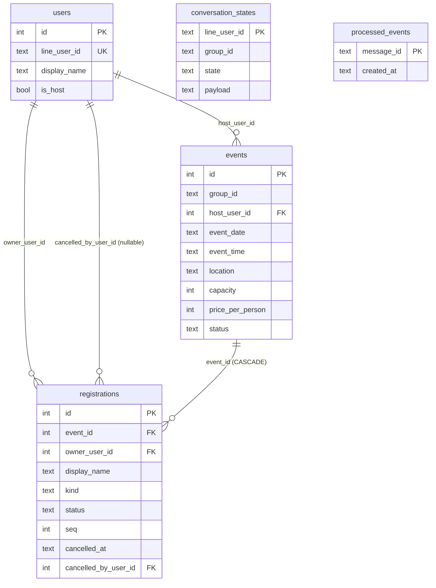

# D-001: 資料模型（per-slot 報名、候補、代報名）

- 狀態：APPROVED（2026-07-22，經 architect-reviewer 審查通過 + errata 修正 + 使用者核可）
- 撰寫者：architect
- 關聯：Brief 章節「資料模型（草案）」§51–56 / 「決策紀錄」§79–85 / 「成功長什麼樣子」§8–14 / 「關鍵使用者旅程」§87–91 ・ 任務 T-004 ・ 設計 D-001
- 相關 ADR：ADR-001（per-slot 而非 count；含 soft-delete 增訂）、ADR-002（防超賣併發策略；含取消交易鎖語意）

## 一、設計內容

本文件把 Brief 資料模型草案落地為可實作的正式 schema，涵蓋 5 張表：
`users`、`events`、`registrations`（per-slot）、`conversation_states`、`processed_events`。
目標：一名額一列的報名模型（ADR-001）、防超賣併發語意（ADR-002）、顯示名稱快照（NFR-4）、
webhook 冪等（NFR-2）、同 group 單一進行中活動（定案 #3）、**取消採 soft-delete 保留稽核軌跡（Q3 裁決）**。

### 0. 全域約定

- **識別鍵**：每張業務表用整數代理主鍵 `id`（surrogate key）；LINE 端識別（`line_user_id`、
  `group_id`、`message_id`）為業務欄位/自然鍵，加 UNIQUE/PK 約束。
- **時間**：一律以 **ISO-8601 UTC 字串**（如 `2026-07-22T09:30:00Z`）表示，欄位型別 SQLite `TEXT` /
  PostgreSQL `TIMESTAMPTZ`。**所有時間戳一律由應用層以 UTC ISO-8601 顯式寫入；TEXT 欄不使用
  `CURRENT_TIMESTAMP` 預設**（errata issue-1 採方案 b）。理由：SQLite 的 `CURRENT_TIMESTAMP` 會產生
  `YYYY-MM-DD HH:MM:SS`（空格分隔、無 `T`/`Z`），與本文件自訂的 ISO 格式及 PostgreSQL `TIMESTAMPTZ`
  回讀形態不一致，破壞「跨兩 DB 一致」；且 `registrations.created_at` 作 FIFO 次要排序依據時，
  空格（0x20）< `T`（0x54）會使兩種格式的字典序錯亂。改由應用層單一時鐘、單一格式寫入，最穩健
  （better-sqlite3 為同步寫入，時間戳於 repository 產生後帶入參數）。跨兩種 DB 一致，應用層以 UTC 讀寫、
  顯示時轉 `Asia/Taipei`。
  （例外：`events.event_date`/`event_time` 為使用者輸入之顯示文字，非時間戳，見 §2 與 Q2 裁決。）
- **布林**：SQLite 以 `INTEGER`（0/1）+ `CHECK (col IN (0,1))`；PostgreSQL 以 `BOOLEAN`。
- **金額**：`price_per_person` 存**整數新台幣元**（`INTEGER`），不使用浮點；預估總金額由應用層計算。
- **連線 PRAGMA（SQLite）**：連線建立時設定 `PRAGMA journal_mode=WAL;`、
  `PRAGMA foreign_keys=ON;`、`PRAGMA busy_timeout=5000;`（見 ADR-002）。

#### 型別對映總表

| 語意 | SQLite | PostgreSQL |
|---|---|---|
| 代理主鍵 | `INTEGER PRIMARY KEY AUTOINCREMENT` | `BIGINT GENERATED ALWAYS AS IDENTITY`（或 `BIGSERIAL`） |
| 短字串/ID | `TEXT` | `TEXT`（或 `VARCHAR`） |
| 列舉 | `TEXT` + `CHECK (col IN (...))` | `TEXT` + `CHECK`（MVP 不用原生 `ENUM`，利於遷移） |
| 布林 | `INTEGER` 0/1 + `CHECK` | `BOOLEAN` |
| 整數金額/計數 | `INTEGER` | `INTEGER` |
| 時間戳 | `TEXT`（ISO-8601 UTC，應用層寫入） | `TIMESTAMPTZ`（應用層寫入 UTC ISO-8601） |
| JSON 資料 | `TEXT`（JSON 字串） | `JSONB`（或 `TEXT`） |

> 時間戳一律「應用層寫入」：下列各表的時間欄不宣告 `DEFAULT CURRENT_TIMESTAMP`，由 repository
> 於寫入時帶入 UTC ISO-8601 字串（見 G11）。

---

### 1. 表：`users`

一位 LINE 使用者一列；報名者/代報者/主辦人皆是 user。`display_name` 為「最近一次互動的快照」，
會隨互動更新；**歷史名單的快照存在 `registrations`，不受此更新影響**（NFR-4）。

| 欄位 | SQLite 型別 | PostgreSQL 型別 | NULL | 預設 | 約束 |
|---|---|---|---|---|---|
| `id` | INTEGER PK AUTOINCREMENT | BIGINT IDENTITY PK | NO | 自動 | PK |
| `line_user_id` | TEXT | TEXT | NO | – | **UNIQUE**、NOT NULL |
| `display_name` | TEXT | TEXT | NO | – | NOT NULL（最近快照） |
| `is_host` | INTEGER(0/1) | BOOLEAN | NO | `0`/`false` | `CHECK (is_host IN (0,1))`（SQLite） |
| `created_at` | TEXT | TIMESTAMPTZ | NO | 應用層寫入（UTC ISO-8601） | |
| `updated_at` | TEXT | TIMESTAMPTZ | NO | 應用層寫入（UTC ISO-8601） | 每次快照更新時寫入 |

- 索引：`UNIQUE(line_user_id)`（等同查詢/upsert 鍵）。
- **`is_host` 與 MVP 的關係（Q1 裁決 2026-07-22）**：定案 #6 規定 MVP 的 host 白名單以**環境變數**設定
  （`ADMIN_USER_IDS` 為 Admin；host 白名單另以環境變數提供）。**MVP 不寫入 `is_host`、不以其作為授權依據**，
  授權判斷只認環境變數；`is_host` 欄位**保留供 v2 資料表化管理**。此為應用層決策，schema 兩者皆支撐。
- 寫入慣例：webhook 收到事件時 upsert user（`INSERT ... ON CONFLICT(line_user_id) DO UPDATE SET
  display_name=?, updated_at=?`），確保 `display_name` 為最近快照；`updated_at` 帶入當下 UTC ISO-8601。

---

### 2. 表：`events`

一場球聚一列。狀態機見 §7。**同一 `group_id` 同時最多一場 active 活動**（active = status ∈
{draft, open, closed}），以 partial unique index 於 DB 層強制（定案 #3、Guardrail G3）。

| 欄位 | SQLite 型別 | PostgreSQL 型別 | NULL | 預設 | 約束 |
|---|---|---|---|---|---|
| `id` | INTEGER PK AUTOINCREMENT | BIGINT IDENTITY PK | NO | 自動 | PK |
| `group_id` | TEXT | TEXT | NO | – | NOT NULL（LINE group id） |
| `host_user_id` | INTEGER | BIGINT | NO | – | FK → `users(id)` |
| `event_date` | TEXT | TEXT | NO | – | `YYYY-MM-DD` 顯示文字（Q2 裁決：維持文字） |
| `event_time` | TEXT | TEXT | NO | – | `HH:MM`（24h）顯示文字 |
| `location` | TEXT | TEXT | NO | – | NOT NULL |
| `capacity` | INTEGER | INTEGER | NO | – | `CHECK (capacity > 0)` |
| `price_per_person` | INTEGER | INTEGER | NO | `0` | `CHECK (price_per_person >= 0)`（整數元） |
| `status` | TEXT | TEXT | NO | `'draft'` | `CHECK (status IN ('draft','open','closed','cancelled','done'))` |
| `created_at` | TEXT | TIMESTAMPTZ | NO | 應用層寫入（UTC ISO-8601） | |
| `updated_at` | TEXT | TIMESTAMPTZ | NO | 應用層寫入（UTC ISO-8601） | |

- **Q2 裁決（2026-07-22）**：`event_date`/`event_time` 維持文字（`YYYY-MM-DD` / `HH:MM`），貼近使用者輸入
  與 LINE 顯示；跨時區排序非 MVP 需求。
- 索引與約束：
  - FK：`host_user_id` → `users(id)`。
  - **Partial unique index（單一進行中活動）**：
    - SQLite：`CREATE UNIQUE INDEX ux_events_active_group ON events(group_id) WHERE status IN ('draft','open','closed');`
    - PostgreSQL：語法相同（皆支援 partial index）。
    - 效果：同 group 已有 active 活動時，插入/轉入第二場 active 會被唯一約束拒絕。
  - 查詢用索引：`CREATE INDEX ix_events_group_status ON events(group_id, status);`（查某群目前活動）。

---

### 3. 表：`registrations`（per-slot，核心）

**一個名額一列**（ADR-001）。報名 N 位 → 插入 N 列；取消 N 位 → **soft-delete 標記 N 列（不刪列，Q3 裁決）**。
有效正取數量 = `COUNT(*) WHERE status='confirmed' AND cancelled_at IS NULL`，events 不另存 count（G1）。

| 欄位 | SQLite 型別 | PostgreSQL 型別 | NULL | 預設 | 約束 |
|---|---|---|---|---|---|
| `id` | INTEGER PK AUTOINCREMENT | BIGINT IDENTITY PK | NO | 自動 | PK |
| `event_id` | INTEGER | BIGINT | NO | – | FK → `events(id)` ON DELETE CASCADE |
| `owner_user_id` | INTEGER | BIGINT | NO | – | FK → `users(id)`（報名者／代報者） |
| `display_name` | TEXT | TEXT | NO | – | 報名當下快照；`kind='proxy'` 時為輸入名字（NFR-4） |
| `kind` | TEXT | TEXT | NO | `'self'` | `CHECK (kind IN ('self','proxy'))` |
| `status` | TEXT | TEXT | NO | – | `CHECK (status IN ('confirmed','waitlist'))` — **僅表達佇列位置** |
| `seq` | INTEGER | INTEGER | NO | – | event 內單調遞增；`UNIQUE(event_id, seq)`；取消列仍佔用 |
| `cancelled_at` | TEXT | TIMESTAMPTZ | YES | NULL | **NULL=有效；非 NULL=已取消**（soft-delete 唯一有效性依據；應用層寫入 UTC ISO-8601） |
| `cancelled_by_user_id` | INTEGER | BIGINT | YES | NULL | FK → `users(id)`；記錄執行取消者（owner 或 host），供稽核 |
| `created_at` | TEXT | TIMESTAMPTZ | NO | 應用層寫入（UTC ISO-8601） | FIFO 次要排序依據（單一 ISO 格式確保字典序正確） |

#### 取消語意：soft-delete（Q3 裁決 2026-07-22）
- **status 與 cancelled_at 語意正交，不重疊**：`status` 只表達佇列位置（`confirmed`/`waitlist`），
  **不新增 `cancelled` 值**；「是否已取消」一律以 **`cancelled_at IS NULL`** 判定。
  取捨：避免 status 與 cancelled_at 兩處各自表達取消而不一致；查詢過濾條件單一明確
  （有效列 = `cancelled_at IS NULL`），且遞補時被取消的 waitlist 列自然被排除、無須改其 status。
  代價：所有「有效名額」查詢都必須帶 `cancelled_at IS NULL`（以 partial index 支撐，見下）。
- 取消不刪列，保留 `owner_user_id`、`display_name` 快照、`seq`、`cancelled_at`、`cancelled_by_user_id`
  以供稽核（誰、何時、取消了哪個名額）。

#### 索引
- `ux_reg_event_seq`：**`UNIQUE(event_id, seq)`** — 保證 event 內序號唯一，防競態重複（最後防線）。
  **含已取消列**：被取消列仍佔用其 seq，不回填、不重用（G7）。
- `ix_reg_active`：**partial index `ON registrations(event_id, status, seq) WHERE cancelled_at IS NULL`**
  — 主力查詢索引，僅涵蓋有效列：
  - 名單顯示：`WHERE event_id=? AND status='confirmed' AND cancelled_at IS NULL ORDER BY seq`。
  - 遞補選取：`WHERE event_id=? AND status='waitlist' AND cancelled_at IS NULL ORDER BY seq LIMIT k`。
  - 正取計數：`COUNT(*) WHERE event_id=? AND status='confirmed' AND cancelled_at IS NULL`。
- `ix_reg_active_owner`：**partial index `ON registrations(event_id, owner_user_id) WHERE cancelled_at IS NULL`**
  — `-N` 取消時定位某人**未取消**的名額。
- （稽核查詢如「某 event 所有取消紀錄」為低頻，走全表掃描即可，MVP 不另建索引。）

#### seq 語意（單調、不可變、不重用；取消列保留）
- `seq` 於**同一報名交易內**以 `SELECT COALESCE(MAX(seq),0)+1 WHERE event_id=?` 指派（含已取消列，
  故最大值只增不減）；因報名寫入已序列化（ADR-002：SQLite IMMEDIATE / PG `FOR UPDATE`），無競態。
- `seq` **跨 confirmed 與 waitlist 共用單一序列**，反映「報名進場順序」。因此：
  - 有效正取名單依 `seq` 排序即為到場順序；有效候補依 `seq` 排序即為 FIFO 佇列。
  - **遞補時 `seq` 不變**（只改 `status` waitlist→confirmed），維持相對次序（G7）。
- **取消（soft-delete）後該列 `seq` 保留不變、不回填、不重用**；`seq` 可有「有效列間的間隙」
  （被取消列夾在中間），不影響排序正確性（G7）。
- **顯示編號**（`名字`、`名字(2)`…）為**應用層**渲染：對同一 `owner_user_id`+`display_name`
  在同批的多**有效**列，依序加 `(2)(3)…` 後綴；名單整體序號亦由應用層依有效列的 `seq` 排序後給定，非存於 schema。

#### 候補 FIFO 遞補對 schema 的需求（演算法屬 D-002，schema 支撐如下）
- 判斷可用名額：`available = capacity - COUNT(*) WHERE status='confirmed' AND cancelled_at IS NULL`（交易內計）。
- 整批進場規則（定案 #1）：`+N` 若 `available >= N` → N 列皆 `confirmed`；否則**整批 N 列 `waitlist`**（不部分接受）。
- 遞補觸發（有正取空出：取消或提高 capacity）：於同一交易內
  `SELECT ... WHERE event_id=? AND status='waitlist' AND cancelled_at IS NULL ORDER BY seq LIMIT (釋出數)`
  → `UPDATE status='confirmed'`。**已取消的 waitlist 列因 `cancelled_at IS NOT NULL` 被自動排除**，不會被遞補。
- 競態防護：遞補與報名共用同一序列化交易語意（ADR-002），避免兩處同時判斷可用名額而超賣。

#### 代報名對 schema 的需求（定案 #4）
- `+1 名字` → 插入列：`owner_user_id = 傳訊人 user.id`、`kind='proxy'`、`display_name='名字'`（輸入值）。
- `-1 名字` 取消 → 定位 `WHERE event_id=? AND owner_user_id=? AND kind='proxy' AND display_name=? AND cancelled_at IS NULL`
  → soft-delete（設 `cancelled_at`、`cancelled_by_user_id`）。
- 取消權限「限原代報者或主辦人」為**應用層授權檢查**；schema 以 `owner_user_id`（比對傳訊人）、
  `events.host_user_id`（比對主辦人）支撐授權判斷，並以 `cancelled_by_user_id` 記錄實際取消者供稽核，
  不在 DB 觸發器強制授權。

#### 取消與名額釋出對 schema 的需求（soft-delete）
- MVP `-N` 取消：定位該 owner **未取消**（`cancelled_at IS NULL`）的 N 列，設
  `cancelled_at = now`、`cancelled_by_user_id = 執行者`（先取消 waitlist 或先取消 confirmed 的順序屬 D-002）。
  取消後有效正取數下降，觸發遞補（見上）。
- **`ON DELETE CASCADE` 僅用於「刪除整個 event 列」時連帶清除其 registrations**（維運/資料清理），
  **不用於使用者取消**。使用者的 `取消活動` 是 `events.status → cancelled` 的狀態轉移（不刪列，
  registrations 連同其稽核欄位一併保留）。故 CASCADE 與 soft-delete 不衝突：前者是物理清理、後者是業務取消。

---

### 4. 表：`conversation_states`（逐步開團問答）

主辦人逐步開團問答的暫存狀態。一位使用者同時最多一段進行中對話流程，故以 `line_user_id` 為 PK。

| 欄位 | SQLite 型別 | PostgreSQL 型別 | NULL | 預設 | 約束 |
|---|---|---|---|---|---|
| `line_user_id` | TEXT | TEXT | NO | – | **PRIMARY KEY** |
| `group_id` | TEXT | TEXT | YES | NULL | 對話所屬群組（供 `確認` 時建 event） |
| `state` | TEXT | TEXT | NO | – | 流程節點，如 `awaiting_date`/`awaiting_time`/`awaiting_location`/`awaiting_capacity`/`awaiting_price`/`awaiting_confirm` |
| `payload` | TEXT(JSON) | JSONB | YES | NULL | 已收集的部分 event 欄位（JSON） |
| `updated_at` | TEXT | TIMESTAMPTZ | NO | 應用層寫入（UTC ISO-8601） | 供 TTL 逾時清理判斷 |

- `state` 合法值由 D-003（開團流程）定義；schema 僅存字串，不在 DB 強制列舉（流程節點易演進）。
- **與 events 的關係**：MVP 建議「開團問答期間資料存於 `conversation_states.payload`，直到
  `確認` 才 `INSERT events`」。好處：draft 列不長期滯留；且 `確認` 時的 INSERT open 會直接受
  §2 partial unique index 檢驗 → 兩位主辦人同時完成問答時，第二個 `確認` 被 DB 拒絕（單一進行中活動的安全網）。
- TTL：逾時（如 30 分鐘無互動）由應用層/排程清理；schema 以 `updated_at` 支撐，不在 DB 設 TTL。

---

### 5. 表：`processed_events`（webhook 冪等去重）

以 LINE webhook 事件的 `message.id`（訊息事件）為主鍵，達成 NFR-2 去重。

| 欄位 | SQLite 型別 | PostgreSQL 型別 | NULL | 預設 | 約束 |
|---|---|---|---|---|---|
| `message_id` | TEXT | TEXT | NO | – | **PRIMARY KEY** |
| `created_at` | TEXT | TIMESTAMPTZ | NO | 應用層寫入（UTC ISO-8601） | 供保留期清理 |

- 去重寫入：處理事件前先 `INSERT`（`created_at` 由應用層帶入 UTC ISO-8601）；
  - SQLite：`INSERT OR IGNORE INTO processed_events(message_id, created_at) VALUES (?, ?)`；
  - PostgreSQL：`INSERT INTO processed_events(message_id, created_at) VALUES (?, ?) ON CONFLICT (message_id) DO NOTHING`。
  - **受影響列數為 0 → 表示已處理過 → 直接略過，不再執行報名等副作用**。
- 保留期：定期清理（如保留 7 天）由應用層/排程處理；schema 以 `created_at` 支撐。
- 註：僅對「訊息事件」有 `message.id`；非訊息事件（join/follow 等）若需冪等，另以 webhook
  event 的去重鍵處理（屬 webhook 層，非本表範圍）。

---

### 6. 實體關聯圖（ERD）



`conversation_states` 與 `processed_events` 為無外鍵的操作性表（以 LINE 端 ID 為鍵），故不畫關聯線。

---

### 7. 狀態機

#### events.status

```
draft ──► open ──► closed
  │        │  ▲       │
  │        │  └───────┤ (reopen，選配)
  │        ▼          ▼
  └──► cancelled    done
           ▲          ▲
   open/closed ───────┘
```

合法轉移（其餘一律拒絕）：
- `draft → open`（`確認` 開團／公告）、`draft → cancelled`（放棄）。
- `open → closed`（`關閉報名`）、`open → cancelled`（`取消活動`）、`open → done`（活動結束）。
- `closed → open`（重新開放，選配）、`closed → cancelled`、`closed → done`。
- `cancelled`、`done` 為終態，不可再轉移。
- **active 集合 = {draft, open, closed}**，受 §2 partial unique index 約束（同 group 至多一場）。
- 註：`取消活動`（→ cancelled）為狀態轉移，**不刪 registrations 列**，其報名/取消稽核一併保留。

#### registrations：佇列位置（status）× 有效性（cancelled_at）

`status` 只在 `confirmed`/`waitlist` 間轉移；「取消」是正交的 soft-delete 標記，不是 status 值。

```
佇列位置 status:
   waitlist ──(遞補: 正取空出，僅 cancelled_at IS NULL 才可被選)──► confirmed

有效性 cancelled_at（正交於 status）:
   有效 (cancelled_at = NULL)
        │  (使用者取消 -N / 由 owner 或 host 執行)
        ▼
   已取消 (cancelled_at = now, cancelled_by_user_id = 執行者)   ← 終態
   （不提供「復原取消」；如需重新報名，重新 +N 產生新列與新 seq）
```

- 初始：整批 → `confirmed`（有效名額足）或整批 → `waitlist`（不足，定案 #1），`cancelled_at = NULL`。
- `waitlist → confirmed`：FIFO 遞補（有效列中最小 `seq` 優先），`seq` 不變。
- 取消：`cancelled_at` 由 NULL → now，`status` 不變（其歷史佇列位置保留供稽核）。
- MVP 不做 `confirmed → waitlist` 降級（縮 capacity 的手動調整列為範圍外 v2，見範圍外）。

---

### 8. migration 策略

- **位置**：`src/db/migrations/`，SQL 檔，命名 `NNNN_描述.sql`（四位序號零填充），例
  `0001_init.sql`。序號決定套用順序，一經合併不得修改既有檔（新增以新序號）。
- **追蹤表**：`schema_migrations(version TEXT PK, applied_at TEXT)`；`applied_at` 由 runner 以 UTC ISO-8601
  寫入（同 §0 時間約定）；runner 依序套用尚未記錄的檔。
- **執行方式（建議，未要求本次改 package.json）**：新增 `src/db/migrate.ts` runner（讀 migrations
  目錄、比對 `schema_migrations`、逐檔在交易內套用），並於 `package.json` 加 `"db:migrate":
  "tsx src/db/migrate.ts"`（本任務不改 package.json，列入 T-004 實作交付）。
- **方言差異處理**：MVP 以 SQLite 語法撰寫 `0001_init.sql`；PostgreSQL 差異（IDENTITY、BOOLEAN、
  TIMESTAMPTZ、JSONB）以 §0 型別對映表為準，PG 版可於切換時另建 `migrations-pg/` 或以環境判斷選檔。
  MVP 先交付 SQLite 版，PG 版列入 backlog（切換平台時再產出）。
- **partial index / partial unique index / CHECK**：兩種 DB 皆於 migration 內以 `CREATE [UNIQUE] INDEX
  ... WHERE` 與 `CHECK` 建立（含 `ux_events_active_group`、`ix_reg_active`、`ix_reg_active_owner`），
  不依賴 ORM。

### 9. 與既有骨架的關係與 `src/db/` 模組劃分

現有 `src/`：`config.ts`、`index.ts`、`server.ts`、`webhook/`、`line/`（M0 骨架，尚未引入
`better-sqlite3`——見 task-board backlog，M1 才加）。建議 `src/db/` 分層：

| 檔案/目錄 | 職責 | 依賴 | 被誰依賴 |
|---|---|---|---|
| `src/db/index.ts` | 連線工廠 `openDb()`：建立 better-sqlite3 連線、設 §0 PRAGMA、回傳 handle | better-sqlite3、config | repositories、migrate |
| `src/db/migrations/*.sql` | schema 與索引 DDL（`0001_init.sql`…） | – | migrate |
| `src/db/migrate.ts` | migration runner（比對 `schema_migrations` 逐檔套用） | db/index、migrations | 啟動腳本/CI |
| `src/db/schema.ts` | 各表列的 TS 介面型別（`UserRow`/`EventRow`/`RegistrationRow`…；`cancelled_at`/`cancelled_by_user_id` 為 nullable），**嚴禁 `any`** | – | repositories、domain |
| `src/db/repositories/*.ts` | 資料存取封裝（`user-repository.ts`/`event-repository.ts`/`registration-repository.ts`/`conversation-repository.ts`/`processed-event-repository.ts`）；報名/取消寫入以 **IMMEDIATE 交易**封裝（ADR-002），取消一律 soft-delete；時間戳於此層以 UTC ISO-8601 產生 | db/index、schema | domain（報名/開團邏輯） |

- `DATABASE_URL`（或 SQLite 檔路徑）走環境變數（`config.ts`），不寫死路徑、不進版控。
- domain 層（`src/domain/`，D-002/D-003）只透過 repository 存取，不直接下 SQL。

### 範圍內
- 上述 5 張表 + `schema_migrations` 的完整欄位、型別（SQLite/PG 對映）、約束、索引。
- events 與 registrations 的狀態機、seq 語意、partial unique index（單一進行中活動）。
- 候補 FIFO 遞補、代報名、**取消（soft-delete）與取消稽核（`cancelled_at`/`cancelled_by_user_id`）**、
  冪等去重對 schema 的欄位/索引支撐需求。
- migration 檔案位置/命名/執行建議、`src/db/` 模組分層建議。

### 範圍外
- 報名／取消／遞補的**演算法與訊息組版**（屬 D-002 報名核心）。
- 開團問答**流程節點細節與一行式解析**（屬 D-003 開團流程）。
- host 白名單的執行期管理介面（定案 #6：MVP 走環境變數）。
- 縮減 capacity 造成的 `confirmed → waitlist` 降級（v2；Q3 僅裁決取消策略，未要求縮容降級）。
- 「復原取消」（un-cancel）：MVP 不提供，重新報名以新 `+N` 產生新列。
- 球組編排/收款統計（v2）。
- PostgreSQL 版 migration 實檔（切換平台時產出；MVP 先交付 SQLite 版）。

## 二、Guardrails（Must NOT）

- **G1**：不得以單純 `count` 欄位表示報名/候補數量；`registrations` 必須 per-slot（一名額一列），
  有效正取數以 `COUNT(*) WHERE status='confirmed' AND cancelled_at IS NULL` 聚合（ADR-001）。
- **G2**：不得在無 **IMMEDIATE 交易（SQLite）/ 列鎖 `FOR UPDATE`（PostgreSQL）** 保護下寫入
  或取消 `registrations`（防超賣，ADR-002；取消觸發遞補故同受此交易語意保護）。
- **G3**：不得允許同一 `group_id` 同時存在多於一場 active（status ∈ {draft,open,closed}）活動；
  必須以 partial unique index（`ux_events_active_group`）於 DB 層強制（定案 #3）。
- **G4**：不得使用 `any` 型別（`src/db/schema.ts` 須為每表列定義具體 TS 介面）；不得把任何 secret
  （channel secret / access token / DATABASE_URL 值）寫入 schema、migration 檔或版控。
- **G5**：不得在報名後變更既有 `registrations.display_name`（該欄為報名當下快照，改名不回溯，NFR-4）。
- **G6**：不得僅以應用層記憶體狀態做 webhook 冪等；必須以 `processed_events` 表持久化去重（NFR-2）。
- **G7**：`seq` 一經指派不得變更、回填或重用；遞補（waitlist→confirmed）只改 `status`，`seq` 保持不變；
  **被取消（soft-delete）的列亦保留其 `seq`，不得回填/重用**。
- **G8**：不得省略 FK 與 CHECK 約束（`status`/`kind` 列舉、`capacity>0`、`price>=0`、布林 0/1），
  且 SQLite 連線須 `PRAGMA foreign_keys=ON`。
- **G9（soft-delete）**：**禁止對 `registrations` 直接下 `DELETE`**（凡出現 `DELETE FROM registrations ...`
  一律視為違反，reviewer 可 grep 判定）。使用者取消（`-N`/`-N 名字`/`取消活動`）一律 soft-delete
  （設 `cancelled_at`、`cancelled_by_user_id`）。**唯一允許的 registrations 實體刪除，是刪除其所屬
  `events` 列時由 `ON DELETE CASCADE` 連帶清除**——即程式碼中不得有任何直接針對 `registrations` 的
  `DELETE` 敘述。
- **G10（有效性過濾）**：任何「有效名額」相關查詢（confirmed 計數、名單顯示、候補 FIFO 選取、`available`
  計算、`-N` 定位）不得省略 `cancelled_at IS NULL` 條件；已取消列不得被計入名額或被遞補。
- **G11（時間戳格式）**：不得對 TEXT 時間欄使用 `DEFAULT CURRENT_TIMESTAMP`（會產生非 ISO 的空格格式）；
  所有時間戳一律由應用層以 UTC ISO-8601（`...Z`）顯式寫入（errata issue-1）。

## 三、Acceptance Checks（可驗證的驗收條件）

- [ ] **AC-1**：容量充足時，同一人 `+3` → `registrations` 產生 **3 列**，皆 `status='confirmed'`、
  `cancelled_at IS NULL`、`kind='self'`、`display_name` 為傳訊人快照，`seq` 於該 event 內**單調遞增**
  （可有間隙但嚴格遞增）。（驗證：unit test，對報名 repository / 成功條件 #1）
- [ ] **AC-2**：`capacity=剩 1`，兩筆 `+1` 相繼進入報名交易 → 結束後
  `COUNT(*) WHERE status='confirmed' AND cancelled_at IS NULL <= capacity`（無超賣），其中一筆 1 列
  `confirmed`、另一筆整批進 `waitlist`（或依 D-002 回「已額滿」），**無兩列同時有效 confirmed 超出容量**。
  （驗證：outcome-based unit/整合測試 — better-sqlite3 為同步單行程，兩筆報名交易被序列化，第二筆
  重新計數看到已滿→整批轉候補；斷言以最終列狀態為準，不需真並行執行緒。／ 成功條件 #2、旅程 #2）
- [ ] **AC-3（soft-delete）**：某 owner 有 2 列有效 confirmed，`-2` 後 → 該 2 列**仍存在**且
  `cancelled_at IS NOT NULL`、`cancelled_by_user_id = 執行者`；有效 confirmed 計數
  （`WHERE status='confirmed' AND cancelled_at IS NULL`）減少 2；名單查詢不再顯示該 owner；
  該列 `seq` 保留不變。（驗證：unit test / 旅程 #3、Q3 裁決）
- [ ] **AC-4**：容量滿且有有效 waitlist 列，釋出 1 個正取名額後，**有效列中最小 `seq` 的 waitlist 列**
  被更新為 `confirmed`（其 `seq` 不變）；**已取消的 waitlist 列不得被遞補**。（驗證：unit test / 定案 #2、G10）
- [ ] **AC-5**：`+1 陳大哥`（代報名）→ 產生 1 列 `kind='proxy'`、`display_name='陳大哥'`、
  `owner_user_id = 傳訊人 user.id`、`cancelled_at IS NULL`；`-1 陳大哥` 能以
  `(event_id, owner_user_id, kind='proxy', display_name, cancelled_at IS NULL)` 定位並 soft-delete 該列。
  （驗證：unit test / 定案 #4）
- [ ] **AC-6**：以檔案型 SQLite 寫入若干報名後，關閉並重新開啟連線（模擬重啟），資料完整保留、
  可重新查得同名單（含已取消列的稽核資料）。（驗證：整合測試 / 成功條件 #4、NFR-3）
- [ ] **AC-7**：同一 `message_id` 連續處理兩次 → 第二次 `INSERT OR IGNORE` 影響 0 列而略過，
  **不產生重複有效 registrations**。（驗證：unit/整合測試 / NFR-2）
- [ ] **AC-8**：報名後將對應 user 的 `display_name` 更新（模擬改名）→ 既有 `registrations.display_name`
  維持報名當下值不變。（驗證：unit test / NFR-4）
- [ ] **AC-9**：同一 `group_id` 已有一場 active（draft/open/closed）活動時，插入/轉入第二場 active
  → 因 `ux_events_active_group` **拋出唯一約束錯誤**（被拒）。（驗證：unit test / 定案 #3）
- [ ] **AC-10**：違反約束的寫入被拒：`capacity=0`（違反 `CHECK capacity>0`）、
  `status='foo'`（違反 status CHECK）、`kind='x'`（違反 kind CHECK）、缺 FK 對象的 `event_id`
  （違反 FK，需 `foreign_keys=ON`）。（驗證：unit test / G8）
- [ ] **AC-11**：`registrations` 於同 event 插入重複 `seq` → 因 `UNIQUE(event_id, seq)` 被拒
  （seq 競態最後防線）；且被取消列仍佔用其 seq（無法以其 seq 再插新列）。（驗證：unit test / G7）
- [ ] **AC-12（取消稽核）**：`-N` 取消由 owner 執行時 `cancelled_by_user_id = owner`；由 host 代取消
  他人名額時 `cancelled_by_user_id = host`；`cancelled_at` 記錄取消時刻（UTC ISO-8601）。取消後仍可由該列讀回原
  `owner_user_id`、`display_name`、`kind`、`seq`（稽核軌跡完整）。（驗證：unit test / Q3 裁決）
- [ ] **AC-13（時間戳格式）**：任一表新寫入列的時間欄（`created_at`/`updated_at`/`cancelled_at`）皆符合
  `^\d{4}-\d{2}-\d{2}T\d{2}:\d{2}:\d{2}Z$`（UTC ISO-8601），無空格分隔格式。（驗證：unit test / G11、errata issue-1）

## 討論紀錄（Orchestrator 維護）
| 日期 | 議題 | 使用者裁決 |
|---|---|---|
| 2026-07-22 | Q1 is_host 定位 | 保留欄位、MVP 不寫入不作授權依據（授權只認環境變數） |
| 2026-07-22 | Q2 日期型別 | 維持文字 YYYY-MM-DD / HH:MM |
| 2026-07-22 | Q3 取消策略 | 採 soft-delete 保留稽核（改硬刪除為標記 cancelled_at / cancelled_by_user_id；status 維持 confirmed/waitlist，有效性以 cancelled_at IS NULL 判定） |
| 2026-07-22 | architect-reviewer 審查 | 建議 APPROVED；issue-1（§0 時間戳）採方案(b) errata 修正，新增 G11/AC-13；G9 措辭收斂。nit-3→D-002、nit-4→D-003、nit-5→已補 AC-2 測試備註 |
| 2026-07-22 | 最終核可 | 使用者 APPROVED，解鎖 T-004 實作 |
