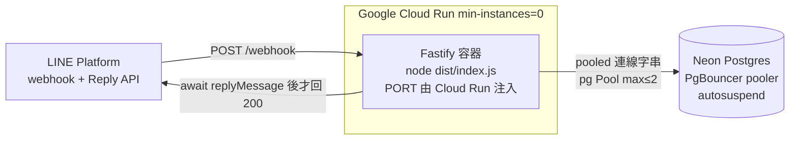

# D-007: Postgres 移植 + serverless（Cloud Run + Neon）部署設計

狀態：DRAFT

- 撰寫者：architect
- 風險：R2（資料 migration + 併發語意變更 + serverless 時序；強制雙 reviewer + e2e，Guardrails ≥3）
- 關聯：ADR-004（決策）、`docs/deployment.md` §5（目標架構草案，本文件之主要輸入）/§6（.sql 複製 bug）、D-001（資料模型、§0 PG 型別對映總表、§8 migration、G2 併發）、ADR-002（防超賣併發）、ADR-003（better-sqlite3 版本）、D-003（runImmediate 防超賣）、D-004（runInTransaction DEFERRED）、D-005（migration 0002 計費三欄）、D-006（授權，無 group_admins → 無 0003）
- 對應任務：T-012（BLOCKED，待本文件 APPROVED 才動工）

> 本文件是**設計文件、不寫實作程式碼**。文中少量程式片段僅用於說明「介面形狀 / SQL 語意」，非交付碼。
> 落實把 `docs/deployment.md` §5 的移植計畫變成可執行、可驗收的設計。

---

## 一、設計內容

### §1 目標架構



- **運算**：Cloud Run 容器，`min-instances=0`（閒置零成本、有請求才起實例）。Cloud Run 於回應送出後可能凍結/回收實例的 CPU（見 §4）。
- **資料庫**：Neon Postgres，經其內建 **PgBouncer pooler**（pooled 連線字串，host 帶 `-pooler`、`sslmode=require`）。autosuspend 閒置休眠、首次查詢喚醒 ~數百 ms（在 LINE reply token ~1 分鐘有效期內，安全）。
- **驅動選型**：採 **`pg`（node-postgres）**。理由：成熟穩定、對 pool/client 有明確控制（利於 §3 的「交易內查詢綁同一 client」）、PgBouncer transaction pooling 相容（node-postgres 預設不用 server-side named prepared statements，故 transaction 模式相容）。放棄 `postgres`（porsager）：API 簡潔但 tagged-template 風格、且 PgBouncer 下需額外關閉 prepared 快取，控制力不如 `pg`。詳見 OP-2。

### §2 架構紅利與影響面（逐檔）

D-001 刻意採 **repository pattern**、domain 不下 SQL（D-001 G10），故移植的**對外契約**（repository 方法名、參數、回傳語意、結果物件形狀）**維持不變**，AC 測試的**期望輸出（斷言值）可重用**。

> **關鍵誠實界定（比 deployment.md §5.2 更精確）**：better-sqlite3 為**同步**、`pg` 為**非同步**。因此雖然介面「形狀」不變，仍有一項**不可避免、機械式、不改邏輯**的變更貫穿全層：**sync → async**（repository 方法回傳 `Promise<T>`、domain 方法變 `async` 並 `await`、測試加 `await`）。**商業分支、決策規則、AC 期望值一律不變**，只是包一層 Promise。這是本次移植真正的工作量所在（大面積但編譯器可攔截），必須據實列入 T-012 範圍，不得以「domain 零改」誤導。

| 檔案 | 是否改 | 變更內容 |
|---|---|---|
| `src/db/index.ts` | 🔧 改 | `openDb()`（better-sqlite3）→ 連線工廠：建立 `pg.Pool`（`DATABASE_URL`、`max≤2`、`ssl`）。移除 PRAGMA（SQLite 專屬）。匯出 `Pool` / `PoolClient` 型別別名（取代 `Db`）。 |
| `src/db/repositories/*.ts`（5 檔） | 🔧 改 | 查詢改 `pg` 參數化（`$1,$2…`、`RETURNING`）；方法變 async；**方法簽名（名/參/回傳語意）不變**。`registration-repository.ts` 的 `runImmediate` 語意見 §3。 |
| `src/db/tx.ts` | 🔧 改 | `createTransactionRunner`（DEFERRED）→ PG 版：checkout client → `BEGIN` → work → `COMMIT`/`ROLLBACK` → `release`。見 §3。 |
| `src/db/migrations/*.sql`（0001/0002） | 🔧 改 | 轉 PG 方言（見 §6）；置於 `migrations/`（PG-only）或 `migrations-pg/`（dual，見 §7/OP-1）。**無 0003**（D-006 作廢 group_admins）。 |
| `src/db/migrate.ts` | 🔧 改 | runner 改 async pg（`schema_migrations` + 有序檔逐檔單交易）；一併解 deployment.md §6 的「.sql 未複製到 dist」問題（見 §6）。 |
| `src/db/schema.ts` | ⚠️ 幾乎不改 | Row 介面（`string`/`number`/`null`）維持——**前提是**時間欄維持 TEXT ISO、`is_host` 維持 0/1（見 §6、OP-4、OP-7）。若改 timestamptz/BOOLEAN 則型別需動 → 故**建議不改**以守「介面不變」。 |
| `src/config.ts` | 🔧 改 | 加 `databaseUrl`（`DATABASE_URL`）；`databasePath` 依 dual/PG-only 保留或移除（見 §7）。 |
| `src/server.ts` | 🔧 改 | **先 `await` 處理（含 `replyMessage`）再回 200**（見 §4）；`buildHandler()` 連線與 repo 組裝改 async pg；migrate 從啟動路徑解耦（見 §6）。 |
| `src/domain/*.ts`（registration-service / event-service / roster / formatter / create-flow / billing） | 🔧 改（機械） | **僅 sync→async**：呼叫 repo/tx 處加 `await`、方法變 `async`；**邏輯/分支/AC 期望值零改**。formatter/create-flow/billing 純函式若不觸 repo 則不動。 |
| `src/webhook/handler.ts` | 🔧 改（機械） | 已是 async；domain 呼叫加 `await`（多數本已 await 或轉 await）。 |
| `Dockerfile`（新增） | ➕ 新 | Cloud Run 容器（見 §8）。 |
| `package.json` | 🔧 改 | deps：加 `pg`+`@types/pg`；better-sqlite3 依 PG-only/dual 決定移除或保留（§7）。scripts：`db:migrate` 改 pg；加 `postbuild` copy（§6）。 |
| `docs/api-contract` / 測試斷言值 | ✅ 不動 | 契約與 AC 期望輸出不變（只加 await）。 |

### §3 併發移植（最關鍵）

**目標不變**：報名（`+N`）、取消（`-N`）、遞補的「count → 決策 → 寫入」必須原子且序列化，防超賣（ADR-002 / D-001 G2）。

**SQLite 現況**：`RegistrationRepository.runImmediate(work)` = `db.transaction(work).immediate()`，全域單寫入者序列化，同步。

**PG 等價（更佳）**：以交易 + 對**該活動列**上行鎖取代全域鎖——

```sql
BEGIN;
SELECT id FROM events WHERE id = $1 FOR UPDATE;   -- 鎖住這場活動（只序列化同場報名）
-- 鎖內：countConfirmed → 整批決策(available>=N?) → insertSlots / cancelByIds / promote
COMMIT;   -- 或 ROLLBACK
```

- 只序列化「同一 event」的併發報名，不同 event 平行 → 併發性優於 SQLite 全域鎖。**正確性等義**：第二個並行報名的 `SELECT … FOR UPDATE` 會阻塞到第一個 `COMMIT`，之後才 `countConfirmed` 看到已更新的正取數 → 不超賣（Postgres 真實列鎖，跨連線亦生效，強於 SQLite）。
- `runImmediate` 抽象保留、對 domain 的呼叫語意保留；PG 版改為「checkout client → `BEGIN` → `SELECT … FOR UPDATE $eventId` → 執行 work → `COMMIT`」。因需先鎖 event，PG 版簽名建議帶 eventId：`runImmediate(eventId, work)`（domain signup/cancel 均已握有 event.id，改動極小；屬 sync→async 之外唯一的簽名微調，reviewer 需知悉）。

> **連線一致性——本移植最易犯的靜默 bug（列為 G1）**：pg pool 下，若交易內不同查詢各自 `pool.query()` 會**落在不同連線** → `FOR UPDATE` 的鎖在 client A、`INSERT` 卻在 client B → **鎖失效、靜默超賣**。因此：**一筆交易的所有查詢（含 `SELECT FOR UPDATE`、count、insert、promote、markProcessed）必須跑在同一個 checked-out `PoolClient` 上**。設計上以「交易 runner checkout 一個 client，並把該 client 綁給交易內使用的 repository 原語」達成（見下「repository 綁 client」）。

**repository 綁 client（維持方法簽名不變的做法）**：repository 建構子由「接 `Db`」改為「接 `Queryable`（`Pool | PoolClient`）」——與現況「接 db handle」同構。非交易唯讀查詢用綁 `Pool` 的 repo（`pool.query` 自動借還一次連線，單筆讀安全）；交易寫入時，runner checkout 一個 `client`、以綁該 `client` 的 repo 執行 work → 交易內所有查詢天然同連線。方法名/參數/回傳語意不變（僅 async）。

**`runInTransaction`（DEFERRED，開團/生命週期，D-004）→ PG**：對應 `BEGIN … COMMIT`（**不需 `FOR UPDATE`**）。同群唯一由 `ux_events_active_group` 於 `INSERT` 當下的唯一約束強制（撞約束 → 窄捕捉 → already_active）。D-004 的 write-first（`markProcessed` 為交易首步）在 PG 仍成立（首寫即進交易）。**G2 carve-out**（主辦自動登記 `insertSlot` 首列於此 DEFERRED 交易內盲插）在 PG 保留：event 於 COMMIT 前不存在、無並行 signup 可觀察，無超賣風險（ADR-004 已論證）。

**窄捕捉 UNIQUE → PG error code**：`event-service.ts` 現以 `err.code === 'SQLITE_CONSTRAINT_UNIQUE'` + 訊息含 `events.group_id` 判定命中 `ux_events_active_group`。PG 改判 **`err.code === '23505'`（unique_violation）** + `err.constraint === 'ux_events_active_group'`（pg 錯誤帶 `constraint` 欄，較訊息比對精確）。其餘任何錯誤（含其他 UNIQUE）一律 re-throw（不得寬捕捉吞例外）。

**去重 `processed_events`**：`INSERT OR IGNORE` → `INSERT … ON CONFLICT (message_id) DO NOTHING`；以「受影響列數（`rowCount`）為 0 → 已處理過 → 略過」判斷（D-001 §5 已規範 PG 形式）。

### §4 serverless 時序（必處理）

**現況（`server.ts`）**：`reply.code(200).send()` **先回**，再 `await handleEvent + replyMessage`。在常駐機（Fly）可行；但 **Cloud Run 預設「CPU 僅於請求期間配置」**，回應送出後實例可能被凍結/回收 → `replyMessage` 可能**不會送出**（回覆漏送）。

**修法**：改為「**先 `await` 完整處理（含 `replyMessage`）→ 再 `reply.code(200)`**」。

- 驗簽（`validateSignature`）失敗仍先回 401（不變）。
- 單則工作 ~5–15ms CPU + `getGroupMemberProfile`（如需）~200–500ms + `replyMessage` ~200–500ms，總計遠在 LINE webhook timeout 與 reply token（~1 分鐘）內，安全。
- 一個 webhook body 可能含多事件：維持 `Promise.all` 並行處理各事件，全部 `await` 完成後才回 200。
- 例外處理維持「單事件失敗記 log 不中止其他」；**全部處理完**才 `reply.code(200).send({ ok:true })`。
- 備案（不採）：Cloud Run 設 `min-instances≥1` + CPU always allocated 可保留舊時序，但那犧牲 $0 serverless 模型 → 放棄，採「先處理再回 200」。

### §5 連線池（Neon pooler）

- 用 **Neon pooled 連線字串**（PgBouncer，host 含 `-pooler`，`?sslmode=require`）。
- 每實例 **小 pool**（`pg.Pool` `max: 1–2`）。理由：Cloud Run 可能起多實例，每實例若開大 pool → 連線數 = 實例數 × pool → 撞 Postgres/Neon 連線上限。小 pool + pooler 兩層防治。
- PgBouncer **transaction pooling** 相容性：`pg` 預設用 unnamed/simple 或 client-side 參數化、不建 server-side named prepared statements → 相容；`BEGIN … FOR UPDATE … COMMIT` 於 transaction 模式下同一交易綁同一後端連線，鎖語意正確。**不得**在交易外依賴 session 狀態（session 變數、`LISTEN/NOTIFY`、advisory session lock）——本專案不使用，安全。
- Neon autosuspend 喚醒與偶發斷線：pool 會重建連線；migration/首請求可能多幾百 ms 延遲，可接受。連線錯誤由 `pg` 拋出 → handler 記 log、該事件不回覆（下次重送冪等）。
- **不得每請求 `new Pool()`**（連線洩漏）；Pool 於實例存活期單例（`buildHandler` 建一次）。

### §6 migration PG 方言 + runner

**方言轉換**（依 D-001 §0 型別對映總表；僅列與 SQLite 檔差異處，語意須等義）：

| 主題 | SQLite（現 0001/0002） | PG 版 | 說明 |
|---|---|---|---|
| 代理主鍵 | `INTEGER PRIMARY KEY AUTOINCREMENT` | `BIGINT GENERATED ALWAYS AS IDENTITY PRIMARY KEY` | D-001 §0 對映 |
| FK | `INTEGER REFERENCES users(id)` | `BIGINT REFERENCES users(id)` | 型別隨主鍵改 BIGINT；`ON DELETE CASCADE` 語法相同 |
| 時間欄 `created_at/updated_at/cancelled_at/applied_at` | `TEXT`（應用層寫 UTC ISO-8601，G11） | **維持 `TEXT`**（建議，見 OP-4） | 保 G11/AC-13（`^…Z$`）、`created_at` 字典序 FIFO、schema TS 型別 `string` 不變、跨 DB 一致。**不採 timestamptz**（會破壞既有不變式）。 |
| 布林 `is_host` | `INTEGER 0/1 + CHECK` | **維持 `SMALLINT 0/1 + CHECK`**（建議，見 OP-7） | 保 UserRow `number` 型別不變；MVP 不用此欄。對 D-001 §0「PG BOOLEAN」為刻意小偏離（deployment.md §5.5 已預留「維持 smallint 相容」），reviewer 知悉。 |
| 金額/計數 | `INTEGER` | `INTEGER` | 不變 |
| 列舉 | `TEXT + CHECK (… IN (…))` | `TEXT + CHECK` | 不用原生 ENUM（D-001 §0，利遷移）；`status`/`kind`/`price_mode` CHECK 值域**一字不改** |
| partial unique index | `CREATE UNIQUE INDEX … WHERE status IN (…)` | 語法**相同**（PG 支援 partial index） | `ux_events_active_group`、`ix_reg_active`、`ix_reg_active_owner` 直接對應 |
| 去重 upsert | `INSERT OR IGNORE` | `INSERT … ON CONFLICT (message_id) DO NOTHING` | D-001 §5 |
| ALTER ADD COLUMN（0002 計費三欄） | `ALTER TABLE events ADD COLUMN … NOT NULL DEFAULT … CHECK(…)` | PG `ALTER TABLE … ADD COLUMN` 支援 NOT NULL+DEFAULT+CHECK | backfill 語意同（既有列 `price_mode='per_person'`、其餘 NULL、零回歸） |
| 參數佔位 | `?` / `@named` | `$1,$2…` | repository 內改寫 |
| `lastInsertRowid` | better-sqlite3 `info.lastInsertRowid` | `INSERT … RETURNING id/*` | insertSlot 等回讀新列改 RETURNING |

- **檔案**：轉出 `0001_init.sql`、`0002_billing_modes.sql` 的 **PG 版**（1:1 對應、保留序號與「一事一檔」精神，利與 D-001/D-005 對照審查）。**無 0003**（D-006 已作廢 group_admins）。放置位置依 §7/OP-1（PG-only：取代 `migrations/`；dual：`migrations-pg/`）。是否把 0001+0002 合併為單一 PG init 見 OP-3（greenfield 可合併，建議仍分檔保序）。
- **runner（`migrate.ts`）**：沿用現機制精神——`schema_migrations(version, applied_at)` + 有序檔、逐檔單交易套用、`applied_at` 應用層 UTC ISO-8601、冪等略過已套用——但改 **async `pg`**。放棄 node-pg-migrate（見 OP-3）。
- **一併解 deployment.md §6（.sql 未複製到 dist）**：容器跑 `node dist/index.js` 時 tsc 不複製 `.sql`。處置採 **`postbuild` 複製** `src/db/migrations*` → `dist/db/migrations*`（deployment.md §6 選項 1，保留 .sql 可審查性）；替代為「.sql 內嵌為 TS 字串 import」（更 serverless-friendly、免 fs，列 OP-3 附註）。
- **執行時機（serverless 重點，見 OP-6）**：**不在每個實例的服務啟動路徑上跑 migrate**（多實例並行 migrate 有競態、且拖慢 cold start）。建議 migrate 為**部署步驟一次性執行**（對 Neon 直連跑 `npm run db:migrate` 或 Cloud Run Job）；服務啟動只建 Pool、不 migrate。若基於簡單仍要 startup migrate，須加 Postgres advisory lock 序列化並容忍已套用。

### §7 config 與 dual-driver vs PG-only（**交使用者裁決，OP-1**）

- 加 `config.databaseUrl = process.env.DATABASE_URL`（Neon pooled 連線字串，走 env、不進版控）。
- 兩條路線：
  - **dual-driver**：本機/測試留 SQLite（`DATABASE_PATH`）、prod 用 PG（`DATABASE_URL`）；以 env 存在與否選驅動。優點：本機零依賴、測試快；缺點：**雙份 repository + 雙份 migration 方言**長期維護，且**併發語意不同**（SQLite IMMEDIATE vs PG FOR UPDATE）→ 兩套防超賣實作各自為政、易漂移，「本機綠 prod 紅」風險（R2 正確性）。
  - **PG-only**：全環境 PG（本機/CI 以 docker-compose postgres 或 Neon 分支）。優點：**單一實作**、單一併發語意、消除方言漂移；缺點：本機需 docker/雲 DB。
- **建議：PG-only**。理由：防超賣正確性是 R2 核心，**保留兩套併發實作的風險 > 本機便利的收益**；且 PG-only 消除 §6 雙方言維護。若使用者強烈重視「離線/零依賴本機開發」才選 dual。裁決見 OP-1。

### §8 Dockerfile（Cloud Run）綱要

多階段（PG-only → 無 better-sqlite3 native → 免 build tools、image 小、cold start 快）：

```dockerfile
# build 階段
FROM node:22-slim AS build
WORKDIR /app
COPY package*.json ./
RUN npm ci
COPY . .
RUN npm run build          # tsc + postbuild 複製 migrations 到 dist

# runtime 階段
FROM node:22-slim
WORKDIR /app
ENV NODE_ENV=production
COPY package*.json ./
RUN npm ci --omit=dev
COPY --from=build /app/dist ./dist
# PORT 由 Cloud Run 注入（預設 8080）；config.port = process.env.PORT ?? 3000 已相容
CMD ["node", "dist/index.js"]
```

- 健康檢查：Cloud Run 以 HTTP 探 `/health`（現有、回 `{status:'ok'}`，不依賴 DB）。
- `listen({ host:'0.0.0.0' })` 已符合容器要求（現況已是）。
- **不得**把 secret 寫入 image（`DATABASE_URL`/憑證一律 runtime env/secret）。
- dual-driver 若保留 better-sqlite3，runtime 需 native build tools 或 prebuilt → image 較大、cold start 較慢（PG-only 之附帶收益）。

### §9 部署步驟綱要（細節 runbook 於 T-012 實作後補）

1. **Neon**：建 project/DB → 取 **pooled** 連線字串（host 含 `-pooler`、`sslmode=require`）。
2. **Migrate**：對該 `DATABASE_URL` 一次性跑 `npm run db:migrate`（建 5 表 + schema_migrations + 索引/約束）。
3. **Image**：`docker build` → push 至 Artifact Registry。
4. **Cloud Run deploy**：`--min-instances=0`、設 env/secret（`LINE_CHANNEL_SECRET`、`LINE_CHANNEL_ACCESS_TOKEN`、`DATABASE_URL`、`ADMIN_USER_IDS`；`DEBUG_WEBHOOK` 不設）；`--concurrency` 建議小（如 1–4，配合小 pool）；取得 `https://<svc>.run.app`。
5. **LINE Console**：Webhook URL 設 `https://<svc>.run.app/webhook`（固定、永久）。
6. **驗證**：真機跨試關鍵流程（名單/+N/整批候補/取消觸發遞補/代報名），確認回覆不漏送（§4）。

---

## 二、Guardrails（Must NOT；R2）

- **G1（防超賣正確性不得退化）**：所有 `registrations` 讀改寫（`+N`/`-N`/遞補）必須在**單一交易**內、先 `SELECT … FROM events WHERE id=$1 FOR UPDATE` 鎖住該 event 後，才 count → 決策 → insert/promote；**且該交易的所有查詢必須跑在同一個 checked-out `PoolClient`**（不得以獨立 `pool.query()` 讓不同查詢落在不同連線，否則 FOR UPDATE 失效 → 靜默超賣）。禁在無 FOR UPDATE / 跨連線下做容量判定。
- **G2（repository 對外契約不變）**：repository 方法名、參數、回傳語意、domain 結果物件形狀**不得變**；僅允許 **sync→async** 機械轉換與 `runImmediate` 帶 `eventId` 之微調。**不得**趁移植改任何商業規則、分支或 AC 期望值（domain 邏輯零改、AC 斷言值可重用）。
- **G3（serverless 時序）**：webhook 必須**先 `await` 完整處理（含 `replyMessage`）再回 200**；**不得**在回 200 後才 `await` 任何 DB/reply 工作（Cloud Run 凍結會漏送回覆）。
- **G4（連線防治）**：Neon 必用 **pooled** 連線字串；`pg.Pool` `max ≤ 2` 且**每實例單例**（不得每請求 `new Pool()`）；交易期間查詢不得跨連線。
- **G5（migration PG 方言等義）**：欄位、型別語意、`NOT NULL`/`DEFAULT`、CHECK 值域、FK（含 `ON DELETE CASCADE`）、partial unique index（`ux_events_active_group`）與其餘 index（`ix_reg_active`/`ix_reg_active_owner`/`ix_events_group_status`/`ux_reg_event_seq`/`ux_users_line_user_id`）**一個都不得漏或改語意**；時間欄維持 TEXT ISO（**不得**退化 G11/AC-13）、金額整數、`seq` 語意（G7）、soft-delete（**禁 `DELETE FROM registrations`**，G9）、去重（`ON CONFLICT DO NOTHING` 等義 `INSERT OR IGNORE`）保持。
- **G6（型別安全與秘密）**：延續 D-001 G4——**禁 `any`**（PG Row 型別以具體介面標註，`pg` 查詢結果須 cast 具體型別）；**不得**把 `DATABASE_URL`/憑證寫入版控、Dockerfile、migration 檔。窄捕捉改對 **PG `23505` + `constraint === 'ux_events_active_group'`**，**不得寬捕捉吞其他錯誤**（其餘一律 re-throw）。
- **G7（migration 執行安全）**：migrations 須冪等，且**不得在多實例服務啟動的請求服務路徑上無鎖並行執行**（避免競態）；建議與服務啟動解耦為部署步驟，或加 Postgres advisory lock 序列化。

---

## 三、Acceptance Checks（`[D-007 AC-n]`，可轉測試/驗證）

- [ ] **[D-007 AC-1]（既有 domain AC 全綠）**：PG repository 下，D-001（AC-1~13）、D-003、D-004、D-005、D-006 的既有 outcome-based AC **全數通過**（測試僅加 `await`、期望值不變）。涵蓋防超賣（D-001 AC-2）、去重（AC-7/AC-14）、候補遞補（AC-4）、soft-delete 稽核（AC-3/AC-12）、計費估算/結算、授權 canManageEvent。
- [ ] **[D-007 AC-2]（FOR UPDATE 序列化防超賣）**：`capacity` 剩 1，**兩個並行 `PoolClient`** 對同一 event 各 `+1`（各自 `BEGIN; SELECT … FOR UPDATE; count; insert; COMMIT`）→ 第二者阻塞至第一者 COMMIT，結束後 `COUNT(*) confirmed AND cancelled_at IS NULL ≤ capacity`（無超賣）；一筆 confirmed、另一筆整批 waitlist（或額滿）。（真並行、兩連線）
- [ ] **[D-007 AC-3]（交易連線一致性）**：交易內 `SELECT FOR UPDATE`、count、insert 皆走**同一 client**（以探針/整合手段驗證；或以 AC-2 的並行不超賣間接證明鎖生效）。反例（各查詢用 pool.query）須能被測到超賣 → 證明 G1 之必要。
- [ ] **[D-007 AC-4]（serverless 先處理再回 200）**：webhook handler 於 `reply.code(200)` **之前**已完成 `handleEvent` 與 `replyMessage`（以 spy 斷言 reply API 於回 200 前被呼叫；或觀察呼叫順序）。驗簽失敗仍先回 401。
- [ ] **[D-007 AC-5]（migration PG 建表等義）**：對空 PG（docker/Neon 分支）跑 migrate → 5 表 + `schema_migrations` 建立，欄位/型別/CHECK 值域/FK/partial unique index 齊備；重跑冪等（applied 空、skipped 全部）。`ux_events_active_group` 生效：同 group 第二場 active `INSERT` 被拒（`23505`）。
- [ ] **[D-007 AC-6]（時間欄格式不退化）**：PG 新寫入列的 `created_at`/`updated_at`/`cancelled_at` 皆符合 `^\d{4}-\d{2}-\d{2}T\d{2}:\d{2}:\d{2}Z$`（TEXT ISO，等義 D-001 AC-13）。
- [ ] **[D-007 AC-7]（連線池）**：`pg.Pool` `max ≤ 2` 設定生效、實例單例；Neon autosuspend 喚醒後首查詢成功（重連容錯）。
- [ ] **[D-007 AC-8]（去重 ON CONFLICT）**：同 `message_id` 連續兩次 → 第二次 `ON CONFLICT DO NOTHING` `rowCount=0` → 略過，**不產生重複有效 registrations**（等義 D-001 AC-7 / D-004 AC-14）。
- [ ] **[D-007 AC-9]（窄捕捉 23505）**：`confirm` 撞 `ux_events_active_group` → `already_active`；其他錯誤（含其他 UNIQUE）一律 re-throw（不被吞）。
- [ ] **[D-007 AC-10]（健康檢查）**：`GET /health` 回 200 `{status:'ok'}`（不因 DB 未就緒而失敗）。
- [ ] **[D-007 AC-11]（Dockerfile 可跑 image）**：`docker build` 成功、image 無 better-sqlite3 native 相依（PG-only）；`node dist/index.js` 於容器內成功 `listen` 注入的 `PORT`；`dist/db/migrations*` 內含 `.sql`（postbuild 生效，解 §6）。

---

## 四、開放問題 OP（附建議，交使用者裁決）

- **OP-1（路線：dual-driver vs PG-only）**——**建議 PG-only**。防超賣正確性（R2）不宜維護兩套併發實作（SQLite IMMEDIATE vs PG FOR UPDATE 易漂移、「本機綠 prod 紅」）；PG-only 消除雙方言維護。本機/CI 以 docker-compose postgres。若使用者重視離線/零依賴本機開發 → 選 dual（代價：雙 repository+雙 migration 長期維護）。
- **OP-2（PG 驅動）**——**建議 `pg`（node-postgres）**。成熟、pool/client 控制明確（利 §3 交易同連線）、PgBouncer transaction 相容。放棄 `postgres`(porsager)（tagged-template、PgBouncer 需額外關 prepared 快取）。
- **OP-3（migration 工具）**——**建議沿用 bespoke runner（async pg 重寫）** + `.sql` 分檔 + `schema_migrations`。少依賴、可控、一併解 §6（postbuild copy；替代：內嵌 SQL 為 TS 字串以免 fs、更 serverless-friendly）。放棄 node-pg-migrate（引入 DSL/依賴，MVP 過重）。附：0001+0002 是否合併為單一 PG init（greenfield 可合併，建議仍分檔保序、利對照 D-001/D-005）。
- **OP-4（時間型別）**——**建議 TEXT ISO（維持）**。保 G11/AC-13、`created_at` 字典序 FIFO、schema TS `string` 型別不變、跨 DB 一致。timestamptz 較 native 但破壞既有不變式、需動 schema.ts/domain → MVP 不採。
- **OP-5（本機/CI 測試對 PG）**——**建議 docker-compose postgres（本機 + CI service container）** 跑真 PG 方言；Neon 分支作 staging 驗證。保留 SQLite 測試僅在選 dual（OP-1）時。
- **OP-6（migration 執行時機）**——**建議部署步驟一次性執行**（不在每實例 startup 跑），避免多實例競態 + 縮 cold start。若堅持 startup migrate → 加 Postgres advisory lock。
- **OP-7（`is_host` 型別）**——**建議維持 SMALLINT 0/1 + CHECK**（保 UserRow `number` 不變、MVP 不用此欄），對 D-001 §0「PG BOOLEAN」為刻意小偏離（deployment.md §5.5 已預留「維持 smallint 相容」）。若使用者/reviewer 要求嚴守 §0 → 改 BOOLEAN 並同步 UserRow 型別 + 相關 repo cast。

---

## 五、跨文件協調

- **ADR-004 ↔ ADR-002/003**：ADR-004 延伸 ADR-002（防超賣機制 SQLite IMMEDIATE → PG FOR UPDATE，目標與 G2 雙軌措辭一致）；收斂 ADR-003（better-sqlite3 版本 pin 僅約束 SQLite 路徑，PG-only prod 後對 prod 失效，dual 下仍約束本機路徑）。
- **D-001 §0（PG 型別對映總表）**：§6 之方言轉換以其為權威依據；本文件對 `is_host`（OP-7）與時間欄（OP-4）相對 §0 的裁量已明確記錄，待使用者裁決後回填。**不改 D-001**（APPROVED）；若裁決需調 §0 措辭，回報 Orchestrator 由 architect 處理。
- **deployment.md §5/§6 收斂**：§5（目標架構草案）由本文件落為可執行設計；§6（.sql 複製 bug）於 §6/OP-3 一併承接解決。建議 Orchestrator 於 deployment.md §5/§6/§7 標註「已由 ADR-004 + D-007 承接」（回寫非本文件範圍）。
- **D-003/D-004/D-005/D-006**：防超賣（D-003 runImmediate）→ §3 FOR UPDATE；開團/生命週期（D-004 runInTransaction DEFERRED、窄捕捉、G2 carve-out）→ §3 PG 對應；計費三欄（D-005 migration 0002）→ §6 ADD COLUMN PG 版；授權（D-006 無 group_admins）→ **無 0003**。上述設計文件的 AC 期望值一律不變（僅 async），由 [D-007 AC-1] 覆蓋。

---

## 討論紀錄（Orchestrator 維護）
| 日期 | 議題 | 裁決 |
|---|---|---|
| 2026-07-31 | D-007 DRAFT 產出 | 待 architect-reviewer + design-reviewer（R2 雙審）與使用者對 OP-1~7 裁決後標 APPROVED，解鎖 T-012 |
| 2026-07-31 | OP-1 路線 | **PG-only**（使用者裁決）：全環境 Postgres、單一併發實作；本機測試用 docker postgres、手動 LINE 跨試可直連 Neon。移除 better-sqlite3（prod）。 |
| 2026-07-31 | OP-2~7（技術，orchestrator 採 architect 建議） | OP-2 驅動 `pg`；OP-3 自建 async migration runner + postbuild copy（併解 §6）；OP-4 時間欄維持 TEXT ISO；OP-5 測試用 docker-compose postgres；OP-6 migration 部署時一次性執行（非每實例 startup）；OP-7 is_host 維持 SMALLINT 0/1。 |

> **OP-1~7 全數定案（2026-07-31）**，設計正文與裁決一致。送 R2 雙審；architect-reviewer 為主審（併發正確性/連線一致性/migration 方言），design-reviewer 審「移植後使用者體驗無退化」（回覆不漏送、訊息範本不變）。雙審通過即待使用者最終 APPROVED，解鎖 T-012。
