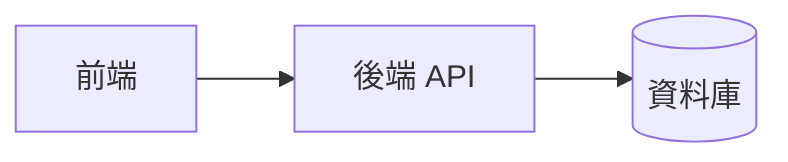

# 01 — Architecture（系統架構）

> 擁有者：architect。實作不得偏離本文件；要偏離先開 ADR。

## 系統概觀
（一段話 + Mermaid 元件圖）

## 模組劃分
| 模組 | 職責 | 對外介面 | 依賴 |
|---|---|---|---|

## 資料模型
（實體、欄位、關聯）

## 技術選型
| 項目 | 選擇 | 理由 | 放棄的替代方案 |
|---|---|---|---|

## 非功能性需求
- 安全：
- 效能：
- 可觀測性（log/監控）：

## 部署
- 環境與流程：
