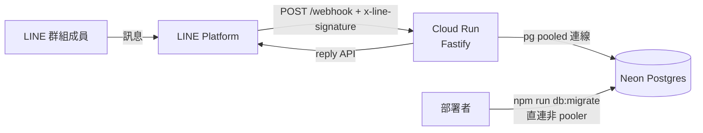

# 01 — Architecture（系統架構）

> 擁有者：architect。實作不得偏離本文件；要偏離先開 ADR。
>
> **本文件由既有實作反向產生（2026-08-05，harness 導入）**，反映的是 **PROD LIVE 的現況**，
> 不是理想狀態。凡現況不理想者一律標【技術債】，不美化為設計決策。
>
> **權威來源分工**：本文件是**入口與索引**。細節的權威來源仍是 `design/D-001`~`D-008` 與
> `docs/adr/ADR-001`~`004`；兩者衝突時以設計文件為準，並回報 Orchestrator 修正本文件。

## 系統概觀

一個沒有前端的 LINE 群組報名機器人。使用者在 LINE 群組打 `+1`，bot 回覆更新後的名單。
對外介面是**對話**而非 REST——REST 面只有 LINE 平台呼叫的 webhook 與健康檢查兩條。

- **執行環境**：Cloud Run（`group-chatbot-504305` / `asia-east1` / min-instances=0）。
- **請求生命週期**：驗簽 → 逐事件 `handleEvent` → **await 完整處理（含 replyMessage）後才回 200**。
  serverless 於回應送出後可能凍結 CPU，先回 200 會導致回覆漏送（D-007 §4 / G3）。
- **無狀態**：實例不持有任何跨請求狀態；對話流程狀態存在 DB 的 `conversation_states`。

## 模組劃分

| 模組 | 職責 | 對外介面 | 依賴 |
|---|---|---|---|
| `src/server.ts` | Fastify app、LINE 驗簽、DI 組裝（Pool → repositories → runners → services → handler） | `POST /webhook`、`GET /health` | 全部下游 |
| `src/webhook/handler.ts` | 事件分派、`processed_events` 去重、result → LINE 訊息的 render、profile 取名 | `handleEvent(event)` | commands、domain、line |
| `src/commands/` | 純函式指令解析：`normalize`（全形/空白）→ `parse` → `ParsedCommand` 判別聯集；`validators` | `parseCommand(text)` | 無（D-002 G2：零副作用） |
| `src/domain/` | 商業邏輯與訊息組版。`registration-service`（報名/取消/FIFO 遞補）、`event-service`（開團狀態機、授權）、`create-flow`（逐步問答）、`billing`、`roster`、`event-formatter` / `list-formatter` | service 方法回傳 result 判別聯集 | db repositories |
| `src/db/` | `tx.ts`（交易 runner，**client-bound repo 綁定**）、`repositories/`（5 支）、`migrate.ts`、`schema.ts`（Row 型別）、`time.ts`（UTC ↔ 台北） | repository 方法 | `pg` |
| `src/line/client.ts` | Messaging API 客戶端（reply、`getGroupMemberProfile`） | — | `@line/bot-sdk` |
| `src/config.ts` | 環境變數集中讀取；**domain 不讀 env**（D-006 G3） | `config` | `dotenv` |

**分層規則**：handler 不寫商業邏輯；domain 不讀 env、不碰 LINE SDK 型別以外的傳輸細節；
repository 不做決策。指令解析在 `src/commands/`，**不在** `src/domain/`（D-001 §9 errata）。

## 資料模型

四張表，詳細 schema、約束與狀態機的權威來源是 **D-001**（含歷次 errata）。

| 表 | 用途 | 關鍵約束 |
|---|---|---|
| `events` | 一場球聚一列 | `ux_events_active_group` partial unique index → **同群組同時只有一場 active 活動**；active 集合 = `{draft, open}`（D-008 T-014 把 `closed` 移出） |
| `registrations` | **per-slot**：一個名額一列 | `status ∈ {confirmed, waitlist}` 只表達佇列位置；取消以 `cancelled_at` 正交表達（不刪列，保留稽核） |
| `conversation_states` | 開團逐步問答的暫存 | PK = `line_user_id` → 一人同時最多一段流程 |
| `processed_events` | webhook `message.id` 去重 | 冪等性不得只靠記憶體（D-001 G6） |

- `events.event_datetime` 存 **UTC ISO-8601 秒精度**，字典序 == 時序，故過期判定可純字串比較；
  顯示時經 `src/db/time.ts` 還原為台北時間（D-008 §3）。
- 金額一律整數新台幣元。`price_mode ∈ {per_person, split_venue}`；均攤採無條件進位，
  關閉報名時把最終攤額快照進 `settled_per_person`（D-005）。

> **errata（2026-08-31，來源 D-020，`design/D-020-multi-event-per-group.md`；DRAFT，尚未核可/
> 未實作——本節僅供追溯與 reviewer 預告，不代表目前系統行為已改變）**：D-020 若通過雙審與使用者
> 核可，`ux_events_active_group`（同群同時只一場 active）將由 migration 0006 取代為兩層語意：
> ① **`ux_events_active_group_venue_time`**（`group_id, location, event_datetime` 唯一，僅擋
> 「同群場地+時間皆相同」的重複活動，不再擋「同群多場並行」）；② 新增 **`message_event_map`**
> 表（bot 訊息 id → 活動 id 映射，供多場並行時 quote-reply 消歧義）。另外，**同群同時最多 3 場
> `open` 活動**的上限（D-020 §3.5）是**應用層計數判斷**（`listActiveByGroup(groupId).length>=3`），
> **不是 DB 約束**——經評估後認為 race window 後果輕微（最多超出 1 場、不影響任何資料完整性
> 不變式），不值得為此加 DB 層安全網。上表在 D-020 落地前**仍是現行系統的權威描述**。

## 併發與正確性（本專案最關鍵的一節）

超賣防護是這個系統唯一真正困難的部分，經歷過兩次真實缺陷：

1. **交易內所有查詢必須綁同一連線**。pool 下若交易內各查詢走 `pool.query()`，
   `SELECT … FOR UPDATE` 的鎖與後續 INSERT 可能落在不同 client → **鎖形同虛設、靜默超賣**。
   實作用 `buildTxRepos(client)` 產出 client-bound repo 注入 work（D-007 路線 A，`src/db/tx.ts`）。
2. **「讀-決策-寫」的決策輸入也必須在鎖內取得**，不只是寫在鎖內。
   T-012 的 B1 缺陷即為 cancel 用交易**外**快照算遞補額度，sync→async 後在 await 讓點被並發插入
   → 正取數 > capacity。修法為改由鎖內 `RETURNING` 的真實列數推導。
3. `createImmediateRunner` 先 `SELECT id FROM events WHERE id=$1 FOR UPDATE` 鎖住該場，再跑 work；
   第二個並行者阻塞至前者 COMMIT 後才重新計數。

> 這兩條通則已在 `harness/LESSONS.md` 登記為回寫候選（各達 2 次），尚未落成 Guardrail 模板——
> 見 task-board 的 `T-016 LESSONS 回寫清償`。

> **errata（2026-08-31，來源 D-020；DRAFT，尚未核可/未實作，僅供追溯）**：若 D-020 落地，多場
> 並行後鎖定粒度**仍是單一 event**（`FOR UPDATE` 鎖該 event 列不變）——group 層級不再有隱含互斥，
> 跨場操作互不阻塞；決定「操作哪一場」的消歧義判斷（quote-reply / `@selector`）發生於進交易**之前**
> （純函式、不觸 DB），交易內鎖定與重讀邏輯本身不變。此點**目前尚未生效**。

## 技術選型

| 項目 | 選擇 | 理由 / ADR |
|---|---|---|
| DB | Postgres（Neon serverless，pooled 連線） | ADR-004。原為 SQLite，因 Cloud Run 無持久磁碟而移植（D-007 / T-012） |
| 執行平台 | Cloud Run（min-instances=0） | ADR-004。真免費層；代價是冷啟動 |
| Web 框架 | Fastify 5 | 輕量、`addContentTypeParser` 便於保留 rawBody 供 LINE 驗簽 |
| 測試 | vitest，**PG-only 打真 DB** | D-007 OP-5。不做 in-memory fake——鎖與併發語意是測試重點，fake 測不到 |
| 遷移 | 手寫 `.sql` + `migrate.ts` | 無 ORM。migrate **從啟動路徑解耦**，是部署步驟（D-007 G7/OP-6） |

歷史決策 ADR-001（per-slot 報名）、ADR-002（交易防超賣）、ADR-003（better-sqlite3 版本 pin）
仍保留供追溯；**ADR-003 已隨 PG 移植失效**，該依賴不復存在。

## 非功能性需求

- **安全**：LINE 簽章驗證失敗即 401；secret 一律 runtime env，不進 image、不進版控（D-007 G6）。
- **冪等**：以 `message.id` 去重。**注意去重政策目前不對稱**——見下方技術債。
- **可觀測性**：Pino 結構化 log。單事件處理失敗只記 log 不中止其他事件。
- **效能**：非瓶頸。bot 只用 reply（不消耗 LINE 的 push 額度）。

## 部署

- `Dockerfile` 多階段（node:22-slim）；PG-only 故無 native 依賴，image 小、冷啟快。
- 流程與線上座標見 `docs/deployment-runbook.md`（含 Neon 建 DB → 直連 migrate → build/push → deploy → LINE Verify → 冒煙）。
- `PORT` 由 Cloud Run 注入；`/health` 不依賴 DB，供平台探活。

## LINE 平台限制（2026-07-31 對照官方文件驗證；2026-08-05 自 task-board 移入）

- **既有接線全數與官方文件相符**：①mention 用 `textV2` + `substitution`（`{type:'mention',mentionee:{type:'user',userId}}`，placeholder `{mN}`）②reply `messages` `maxItems: 5`（本專案最多 2 則）③`getGroupMemberProfile` 回 `displayName` 且**涵蓋未加 bot 好友的群組成員**（印證 AC-19/NFR-4）④驗簽與 replyToken 用法正確。
- **⚠️ 帳號等級限制**：「取群組成員 ID 清單」(`GET /group/{id}/members/ids`) **需 verified 或 premium 官方帳號**；「取單一成員 profile」(`getGroupMemberProfile`) **所有帳號皆可**。本專案只用後者（userId 一律來自 webhook 事件），故不受限。若要做「@全員」「列出未報名者」等需**列舉**成員的功能則會撞到此限。
- **⚠️ 目前完全不用 `pushMessage`**：全系統只有 `replyMessage`（`src/server.ts`），因此不消耗 LINE 的主動訊息額度。**任何「主動提醒」類功能都會打破這個前提**——費用結構見下節。

## 訊息費用結構（2026-08-05 查證，供「主動提醒」類功能評估）

**計費規則（官方 Messaging API 文件）**
- **`replyMessage` 不計費**（"Sending methods that are not counted as message count: Reply messages"）。這就是本專案至今零訊息成本的原因。
- **`push` / `multicast` / `broadcast` / `narrowcast` 全部計費**，且**以「收訊人數」計，不是以請求數計**："The number of messages is counted by the number of people you send a message to."
- **⚠️ 推播到群組 = 按群組總人數計費**。對 30 人的群推一則提醒＝**30 則**，即使只有 12 人報名。
- 超出額度時 **API 回錯誤且訊息不會送出**（不是自動扣款）——提醒功能會靜默失效，需監控用量端點。

**台灣方案（未稅）**

| 方案 | 月費 | 免費則數 | 超出 |
|---|---|---|---|
| 輕用量 | 0 | 200 則 | **不可加購**（直接卡住） |
| 中用量 | 800 | 3,000 則 | 不可加購 |
| 高用量 | 1,200 | 6,000 則 | 每則 NT$0.2 起（階梯累進） |

**對本專案的試算**（每場 12 位正取、每週一場）
- **推播給正取者本人**：12 則/場 → 免費層可支應約 **16 場/月**（≒ 4 個群組各週一場）。
- **推播到群組**：30 人群組 = 30 則/場，且會吵到沒報名的人 → **成本高、體驗差，不建議**。
- ⇒ 設計上應走**個別推播（multicast 給正取者）**，且費用與**群組人數無關、只與報名人數有關**。

**⚠️ 待實測的前提**：個別推播要求對方**已將官方帳號加為好友**。群組成員若從未加好友，可能推不到（LINE 對非好友的 push 行為需實測確認）。此點決定「提醒」能否覆蓋全部報名者，**應在設計前先用真帳號驗證**。

## 【技術債】現況清單

登記於 task-board Backlog，此處建立交叉索引：

| 項目 | 說明 | 出處 |
|---|---|---|
| 去重政策不對稱 | 純拒絕回覆（`no_open_event` / 非白名單 / 無 active）不 `markProcessed`，重送會重覆回覆；有副作用的步驟才 mark。**同型問題已出現 3 次**仍無統一政策 | LESSONS ×3 |
| 遞補會拆散整批 | `pickWaitlistForPromotion` 以列為單位 `LIMIT`，剩餘名額 < 隊首批次人數時會拆批，與「整批不部分接受」的進場原子性不對稱。修法需 `registrations.batch_id` ⇒ migration ⇒ R2 | T-015 / Backlog |
| 防禦死碼 | `formatAlreadyClosed`、`cancelEvent` 的 `status!=='closed'` 分支等，於 D-008 把 closed 移出 active 集合後已不可達 | T-014 reviewer nit |
| 缺未來時間驗證 | `確認` 未驗 `event_datetime > NOW()`，可建立「即刻過期的死團」 | D-008 §六 nit-6 |
| 設計文件治理成本 | 8 份 D 文件 250–563 行且互相 errata（D-005 一次改動觸及 4 份）。已對既有文件豁免行數上限，但缺輕量 errata 協定 | LESSONS ×3 |
| e2e 未覆蓋 | 代報名、候補遞補、主辦 override 取消等關鍵旅程仍只有 unit 覆蓋 | Backlog |

## Changelog

| 日期 | 變更 | 來源 |
|---|---|---|
| 2026-08-05 | 由既有實作反向產生初版（現況快照，含技術債標記） | harness 1.4.0 導入 |
| 2026-08-31 | 預先登記 D-020（同群多場並行活動 + 訊息消歧義，**DRAFT，尚未核可/未實作**）將牽動之處：`events` 索引語意由「同群唯一」變為「同群場地+時間唯一」、新增 `message_event_map`、新增同群 open 數上限（3 場，應用層計數、非 DB 約束）、鎖定粒度說明補充。詳見資料模型與併發章節內 errata 區塊 | D-020 errata（`design/D-020-multi-event-per-group.md`） |
